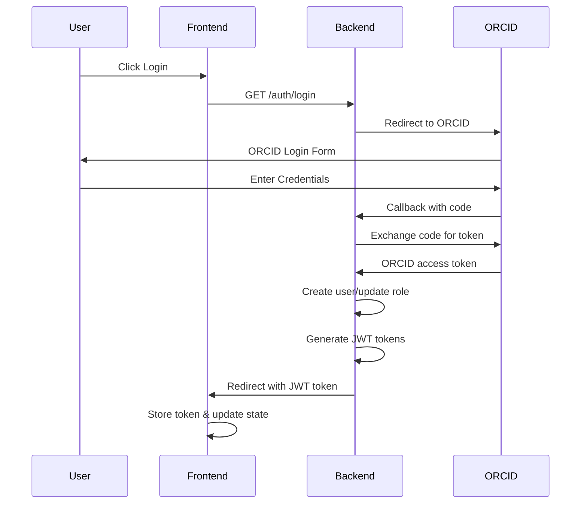
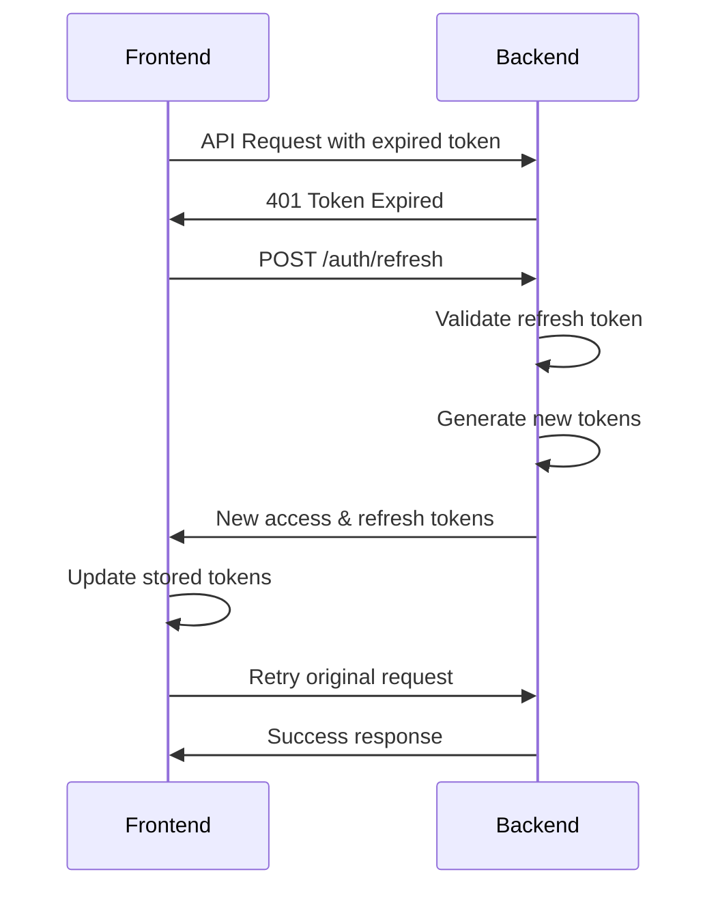

# Authentication Security Improvements

## Overview

This document outlines the security improvements made to the MicrohapDB authentication system, implementing industry best practices for ORCID OAuth2 integration and JWT token management.

## Key Security Enhancements

### 1. **Secure JWT Token Management**

#### Before:
- Default hardcoded JWT secret key
- Basic token verification without proper error handling
- No refresh token mechanism

#### After:
- **Secure Secret Generation**: Automatically generates cryptographically secure JWT secrets if not provided
- **Dual Token System**: Implements both access tokens (24h) and refresh tokens (30 days)
- **Token Type Validation**: Distinguishes between access and refresh tokens
- **Comprehensive Error Handling**: Detailed error responses for different failure scenarios

```python
# Improved JWT utilities with secure defaults
SECRET_KEY = os.getenv("JWT_SECRET_KEY")
if not SECRET_KEY:
    SECRET_KEY = secrets.token_urlsafe(64)  # Cryptographically secure
```

### 2. **Enhanced Authentication Dependencies**

#### Improvements:
- **Multiple Token Sources**: Supports Authorization header, cookies, and manual extraction
- **Optimized Database Queries**: Uses eager loading to prevent N+1 queries
- **Role-Based Access Control**: Granular permission checking for different user roles
- **Graceful Error Handling**: Specific error messages for different authentication failures

```python
# New dependency functions
async def get_current_user_optional()  # For optional auth
async def get_private_user()           # For private user access
async def get_collaborator_user()      # For collaborator access
```

### 3. **Robust Token Refresh Mechanism**

#### Features:
- **Automatic Token Refresh**: Seamless token renewal without user intervention
- **Request Queuing**: Prevents multiple simultaneous refresh attempts
- **Secure Cookie Management**: HttpOnly, Secure, and SameSite cookie attributes
- **Token Rotation**: Issues new refresh tokens on each refresh for enhanced security

```javascript
// Frontend: Automatic token refresh with request queuing
if (isRefreshing) {
  return new Promise((resolve, reject) => {
    failedQueue.push({ resolve, reject });
  });
}
```

### 4. **Improved Frontend State Management**

#### Enhancements:
- **Centralized Token Handling**: Single source of truth for authentication state
- **Loading States**: Better UX with loading indicators during auth operations
- **Error Recovery**: Graceful handling of authentication failures
- **URL Token Processing**: Secure handling of tokens from ORCID callbacks

## Security Best Practices Implemented

### 1. **Environment Configuration**

Required environment variables for secure operation:

```bash
# JWT Configuration
JWT_SECRET_KEY=your-super-secret-jwt-key-here

# ORCID OAuth Configuration
ORCID_CLIENT_ID=your-orcid-client-id
ORCID_CLIENT_SECRET=your-orcid-client-secret
ORCID_REDIRECT_URI=http://localhost:8000/auth/callback

# Environment
ENVIRONMENT=production  # Enables secure cookies in production
```

### 2. **Cookie Security**

```python
# Secure cookie configuration
response.set_cookie(
    key="access_token",
    value=access_token,
    httponly=True,           # Prevents XSS attacks
    secure=is_production,    # HTTPS only in production
    samesite="lax",         # CSRF protection
    max_age=86400           # 24 hours
)
```

### 3. **Token Validation**

- **Type Checking**: Validates token type (access vs refresh)
- **Expiration Verification**: Checks token expiration timestamps
- **Signature Validation**: Verifies JWT signatures
- **Claims Validation**: Ensures required claims are present

### 4. **Error Handling**

- **Specific Error Messages**: Different errors for expired, invalid, or missing tokens
- **Logging**: Comprehensive logging for security monitoring
- **Graceful Degradation**: System continues to function with limited access when auth fails

## Authentication Flow

### 1. **Login Process**



### 2. **Token Refresh Process**



## Role-Based Access Control

### User Roles Hierarchy

1. **Admin**: Full system access
2. **Private User**: Can manage own data and collaborators
3. **Collaborator**: Limited access to shared data
4. **Public**: Read-only access to public data

### Permission Matrix

| Feature | Public | Collaborator | Private User | Admin |
|---------|--------|--------------|--------------|-------|
| View Public Data | ✅ | ✅ | ✅ | ✅ |
| Query Database | ❌ | ✅ | ✅ | ✅ |
| Upload Data | ❌ | ❌ | ❌ | ✅ |
| Manage Users | ❌ | ❌ | Limited | ✅ |
| System Admin | ❌ | ❌ | ❌ | ✅ |

## Security Monitoring

### Logging Events

- User login/logout events
- Token refresh attempts
- Authentication failures
- Permission violations
- Admin role changes

### Recommended Monitoring

```python
# Example log entries
logging.info(f"User {user.full_name} successfully authenticated")
logging.warning(f"User {user.full_name} attempted to access admin endpoint without permissions")
logging.error(f"Token verification failed: {error}")
```

## Production Deployment Checklist

### Backend Security

- [ ] Set strong `JWT_SECRET_KEY` environment variable
- [ ] Configure ORCID production endpoints
- [ ] Set `ENVIRONMENT=production`
- [ ] Enable HTTPS for secure cookies
- [ ] Configure proper CORS origins
- [ ] Set up log monitoring

### Frontend Security

- [ ] Configure production backend URL
- [ ] Enable secure cookie settings
- [ ] Implement Content Security Policy
- [ ] Set up error monitoring
- [ ] Configure proper build optimizations

### Infrastructure Security

- [ ] Use HTTPS for all communications
- [ ] Implement rate limiting
- [ ] Set up firewall rules
- [ ] Configure database security
- [ ] Enable audit logging
- [ ] Regular security updates

## Common Security Issues Addressed

### 1. **XSS Prevention**
- HttpOnly cookies prevent JavaScript access to tokens
- Proper input validation and sanitization

### 2. **CSRF Protection**
- SameSite cookie attributes
- Token-based authentication instead of session cookies

### 3. **Token Leakage**
- Secure token storage in HttpOnly cookies
- Automatic token cleanup on logout
- Short-lived access tokens with refresh mechanism

### 4. **Session Management**
- Proper token expiration handling
- Secure logout process
- Token rotation on refresh

## Troubleshooting

### Common Issues

1. **"JWT_SECRET_KEY not set"**
   - Solution: Set environment variable or allow auto-generation

2. **"Token has expired"**
   - Solution: Automatic refresh should handle this

3. **"CORS errors"**
   - Solution: Configure proper CORS origins in backend

4. **"User not found"**
   - Solution: Ensure user exists in database and ORCID is correct

### Debug Mode

Enable debug logging to troubleshoot authentication issues:

```python
logging.basicConfig(level=logging.DEBUG)
```

## Future Enhancements

### Planned Security Improvements

1. **Multi-Factor Authentication (MFA)**
2. **OAuth2 Scope Management**
3. **Session Management Dashboard**
4. **Advanced Rate Limiting**
5. **Security Headers Middleware**
6. **Audit Trail System**

### Monitoring Enhancements

1. **Real-time Security Alerts**
2. **Authentication Analytics**
3. **Suspicious Activity Detection**
4. **Performance Monitoring**

---

This authentication system now follows industry best practices for security, providing a robust foundation for the MicrohapDB application while maintaining excellent user experience. 